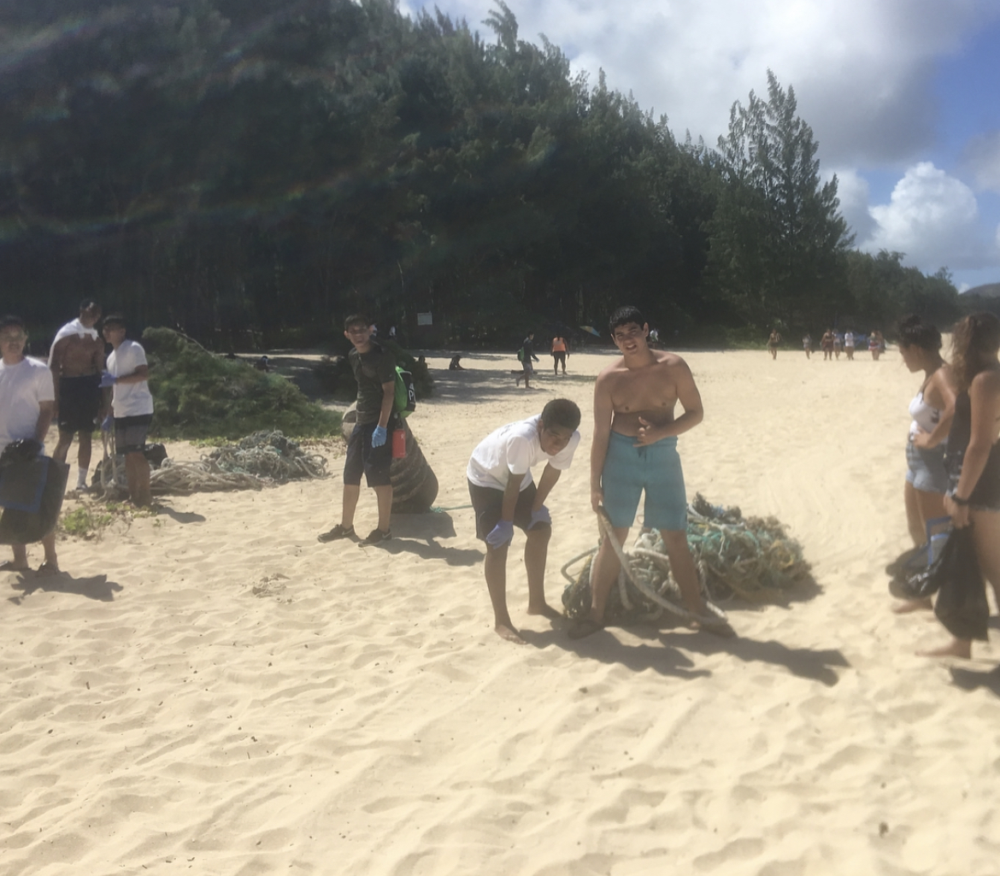

  

This project was a part of my scholarship "PWH" when I was in high school. This scholarship was given to people only to four schools which were Saint Francis, Saint Joeseph in Hilo, Damien High School, and Sacred Hearts. We would do plenty of projects to help our community but this was a very good opportunity. Me and many other scholars volunteer to do a beach cleanup and teamted up with "808cleanups". The beach that we cleanup was Sherwoods Beach in Waimanalo which was one of the few beaches that was filled with many debris and rubbish that was on shore. This was honestly one of the best projects that I enjoyed and helped out the community. 

