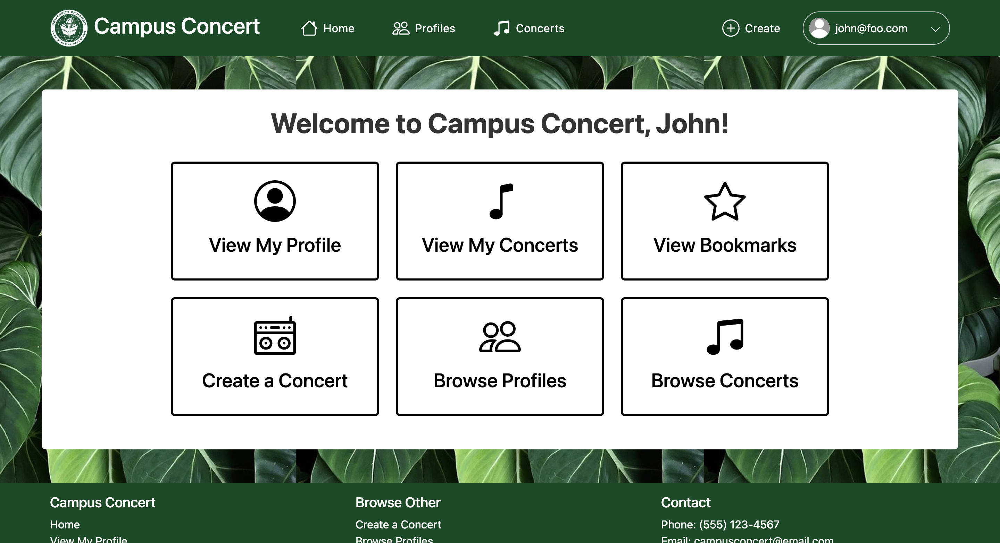

This project was a group project which was our final project for ICS 314 at UH Manoa. This class challenged me mentally and was able to engage with my group. We did JavaScript, HTML, CSS and React.js which helped us for our project and throughout the class. We were able to communicate and help eachother out for this project and I'm really glad how it turned out. 

I know this was an assignment but this helped me a lot to improve my coding skills as far as my communication skills. Every tasks was assigned equally and everyone had a good time. Everyone was able to create an issue, do the issue, and able to merge it into main. Even if we were stuck on an issue, my group was very helpful and was able to give me good ideas. My group was very open-minded and was able to do very good on this project. 

Everyone in my group contributed and it was fair game. What I did was that I was able to make the Landing Page, as far as other things which was the NavBar and other things. One of the few things that I enjoyed the most during this project was able to add a variety of locations and instruments for the user to create it's profile or concert. Some points that I got out of this project was able on how to use GitHub properly, how to merge or create an issue, testing each page, and to able to communicate with one another which I really enjoyed about this project and hopefully use these in the future. 

To learn more about our project : https://campus-concert.github.io/

Link to our website : https://campus-concert.com/

Link to our Repository : https://github.com/campus-concert/campus-concert

  

