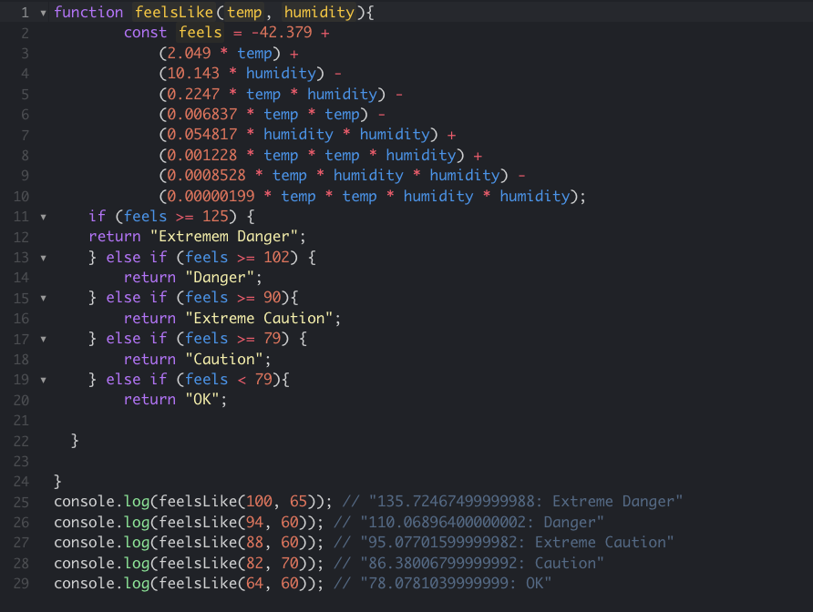

  

#The Practice WOD

This was my first practice WOD for ICS 314. Practice WOD are "Workout of the day", which helps us prepare for the real WOD's on game day. I was a bit nervous for the practice WOD but I had to treat it that it's the real deal. The objective of the practice WOD was that we must create a function called "feelsLike" which would accept two numbers with the first one being the temperature of Fahrenheit and the second being humidity as a value between 0 through 100. Then it should return a string containing the temperature if it's Extreme Danger, Danger, Extreme Caution, Caution, or OK. 

After solving, eventually my code was correct and my time was "Av:10-15 min" which was really good. What I did was add "if" statements for the temperature to see if return the following Extreme Danger, Danger and etc. 

